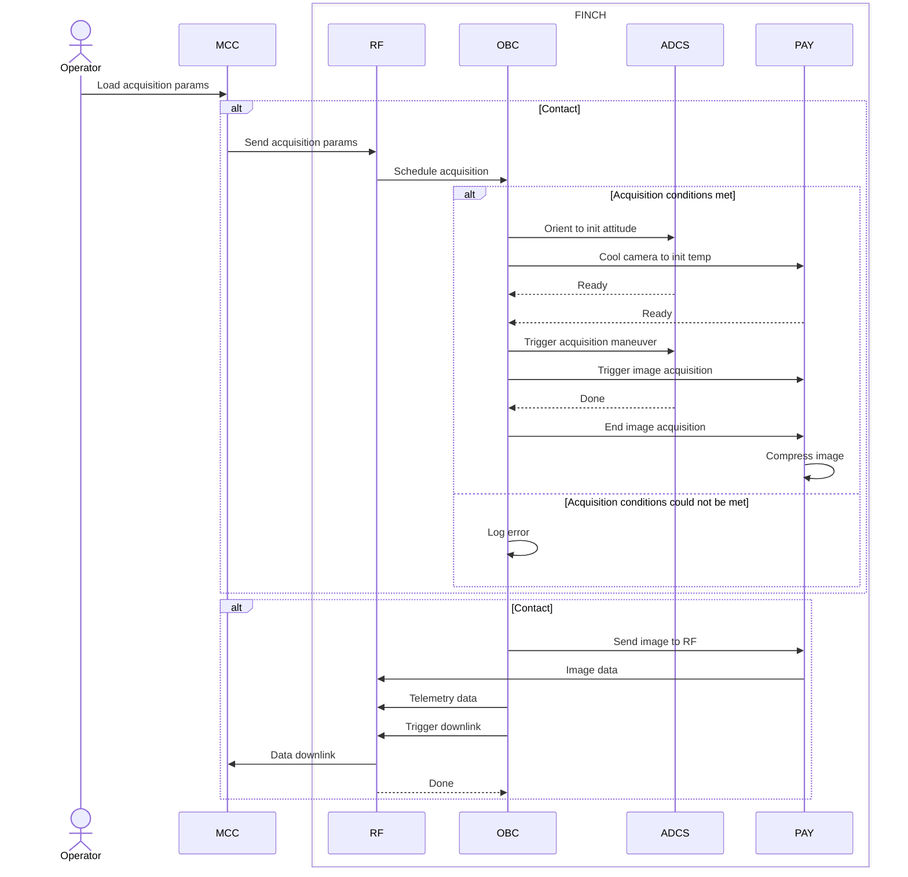

# Image Acquisition Command Sequence

```mermaid
sequenceDiagram
    Actor Operator
    participant MCC
    box FINCH
        participant RF
        participant OBC
        participant ADCS
        participant PAY
    end

    Operator->>MCC: Load acquisition params
    alt Contact
        MCC->>RF: Send acquisition params

        RF->>OBC: Schedule acquisition

        alt Acquisition conditions met
            OBC->>ADCS: Orient to init attitude
            OBC->>PAY: Cool camera to init temp
            ADCS-->>OBC: Ready
            PAY-->>OBC: Ready

            OBC->>ADCS: Trigger acquisition maneuver
            OBC->>PAY: Trigger image acquisition
            ADCS-->>OBC: Done
            OBC->>PAY: End image acquisition
            PAY->>PAY: Compress image


        else Acquisition conditions could not be met
            OBC->>OBC: Log error

        end
    end

    alt Contact
        OBC->>PAY: Send image to RF
        PAY->>RF: Image data
        OBC->>RF: Telemetry data
        OBC->>RF: Trigger downlink
        RF->>MCC: Data downlink
        RF-->>OBC: Done
    end

    

```
