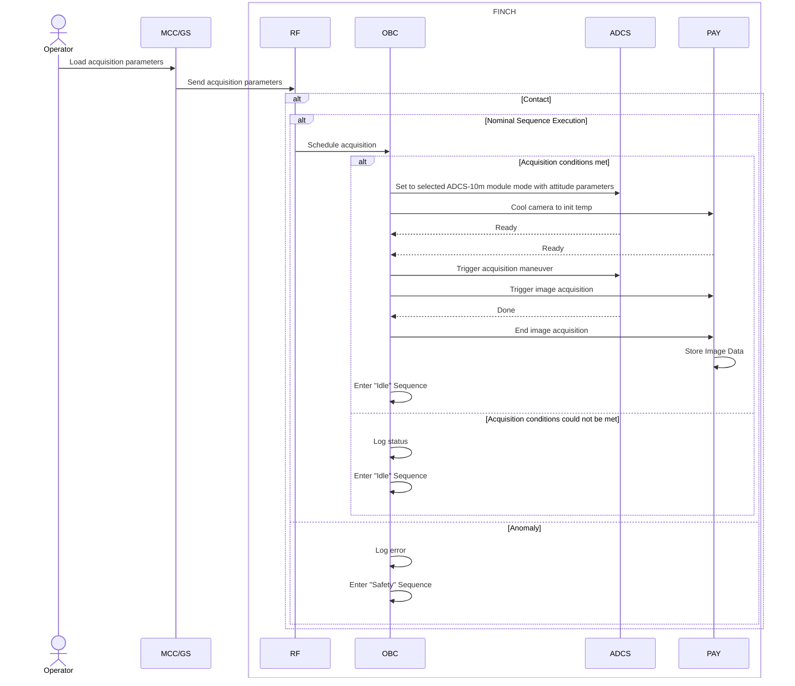

# Image Acquisition Command Sequence

```mermaid
sequenceDiagram
    Actor Operator
    participant MCC/GS
    box FINCH
        participant RF
        participant OBC
        participant ADCS
        participant PAY
    end

    Operator->>MCC/GS: Load acquisition parameters
    MCC/GS->>RF: Send acquisition parameters

    alt Contact
        alt Nominal Sequence Execution
            RF->>OBC: Schedule acquisition

            alt Acquisition conditions met
                OBC->>ADCS: Set to selected ADCS-10m module mode with attitude parameters
                OBC->>PAY: Cool camera to init temp
                ADCS-->>OBC: Ready
                PAY-->>OBC: Ready
    
                OBC->>ADCS: Trigger acquisition maneuver
                OBC->>PAY: Trigger image acquisition
                ADCS-->>OBC: Done
                OBC->>PAY: End image acquisition
                PAY->>PAY: Store Image Data

                OBC->>OBC: Enter "Idle" Sequence

            else Acquisition conditions could not be met
                OBC->>OBC: Log status
                OBC->>OBC: Enter "Idle" Sequence
            end
        else Anomaly
            OBC->>OBC: Log error
            OBC->>OBC: Enter "Safety" Sequence
        end
    end

```
