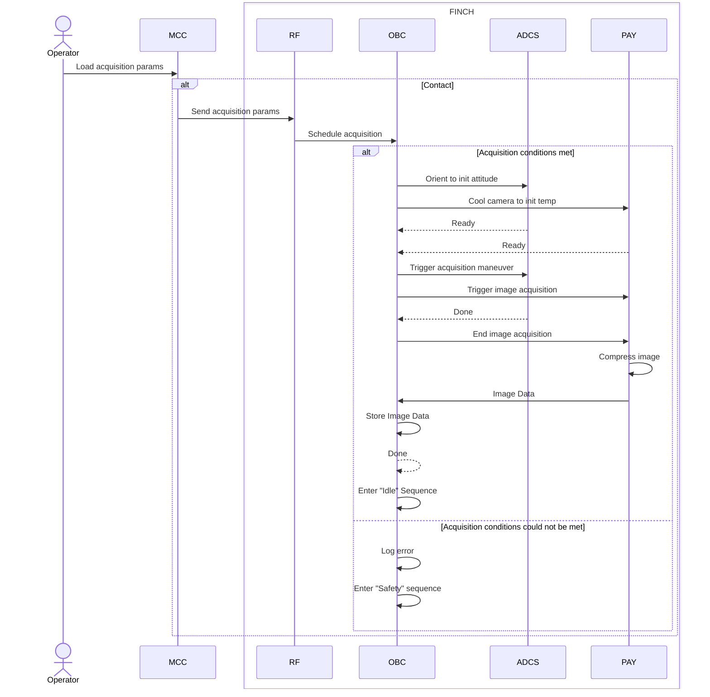

# Imaging Command Sequence

```mermaid
sequenceDiagram
    Actor Operator
    participant MCC
    box FINCH
        participant RF
        participant OBC
        participant ADCS
        participant PAY
    end

    Operator->>MCC: Load acquisition params
    alt Contact
        MCC->>RF: Send acquisition params

        RF->>OBC: Schedule acquisition

        alt Acquisition conditions met
            OBC->>ADCS: Orient to init attitude
            OBC->>PAY: Cool camera to init temp
            ADCS-->>OBC: Ready
            PAY-->>OBC: Ready

            OBC->>ADCS: Trigger acquisition maneuver
            OBC->>PAY: Trigger image acquisition
            ADCS-->>OBC: Done
            OBC->>PAY: End image acquisition
            PAY->>PAY: Compress image
            PAY->>OBC: Image Data
            OBC->>OBC: Store Image Data
            OBC-->>OBC: Done
            OBC->>OBC: Enter "Idle" Sequence


        else Acquisition conditions could not be met
            OBC->>OBC: Log error
            OBC->>OBC: Enter "Safety" sequence

        end
    end


    

```
