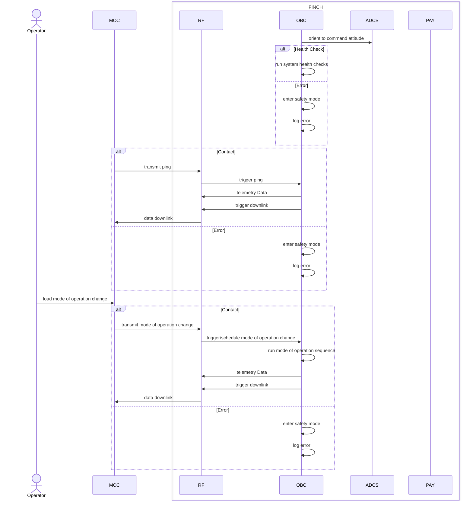

# Image Acquisition Command Sequence

```mermaid
sequenceDiagram
    Actor Operator
    participant MCC
    box FINCH
        participant RF
        participant OBC
        participant ADCS
        participant PAY
    end

    OBC->>ADCS: orient to command attitude

alt Health Check
    OBC->>OBC: run system health checks
else Error
    OBC->>OBC: enter safety mode
    OBC->>OBC: log error
end

alt Contact

    MCC->>RF: transmit ping
    RF->>OBC: trigger ping

    OBC->>RF: telemetry Data
    OBC->>RF: trigger downlink
    RF->>MCC: data downlink

else Error
    OBC->>OBC: enter safety mode
    OBC->>OBC: log error

end

    Operator->>MCC: load mode of operation change

alt Contact
    MCC->>RF: transmit mode of operation change
    RF->>OBC: trigger/schedule mode of operation change
    OBC->>OBC: run mode of operation sequence

    OBC->>RF: telemetry Data
    OBC->>RF: trigger downlink
    RF->>MCC: data downlink

else Error
    OBC->>OBC: enter safety mode
    OBC->>OBC: log error

end

 
    

```
