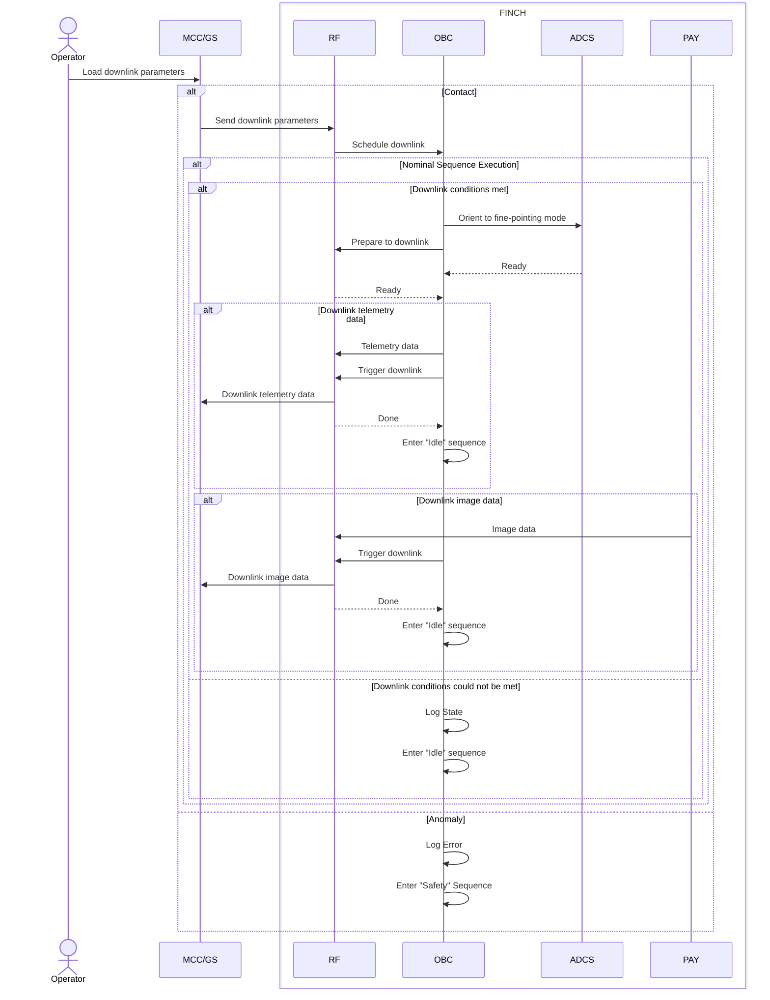

# Downlinking Command Sequence

```mermaid

sequenceDiagram

    Actor Operator
    participant MCC/GS
    box FINCH
        participant RF
        participant OBC
        participant ADCS
        participant PAY
    end

    Operator->>MCC/GS: Load downlink parameters
    
    alt Contact
        MCC/GS->>RF: Send downlink parameters
        RF->>OBC: Schedule downlink

        alt Nominal Sequence Execution
            alt Downlink conditions met
                OBC->>ADCS: Orient to fine-pointing mode
                OBC->>RF: Prepare to downlink
                ADCS-->>OBC: Ready
                RF-->>OBC: Ready
    
                alt Downlink telemetry data
                    OBC->>RF: Telemetry data
                    OBC->>RF: Trigger downlink
                    RF->>MCC/GS: Downlink telemetry data
                    RF-->>OBC: Done
                    OBC->>OBC: Enter "Idle" sequence

                end
    
                alt Downlink image data
                    # what's the criteria for downlinking an image?
                    PAY->>RF: Image data
                    OBC->>RF: Trigger downlink
                    RF->>MCC/GS: Downlink image data
                    RF-->>OBC: Done
                    OBC->>OBC: Enter "Idle" sequence


                end
                
            else Downlink conditions could not be met
                OBC->>OBC: Log State
                OBC->>OBC: Enter "Idle" sequence
            end
        
        end
        else Anomaly
            OBC->>OBC: Log Error
            OBC->>OBC: Enter "Safety" Sequence
        end

```
