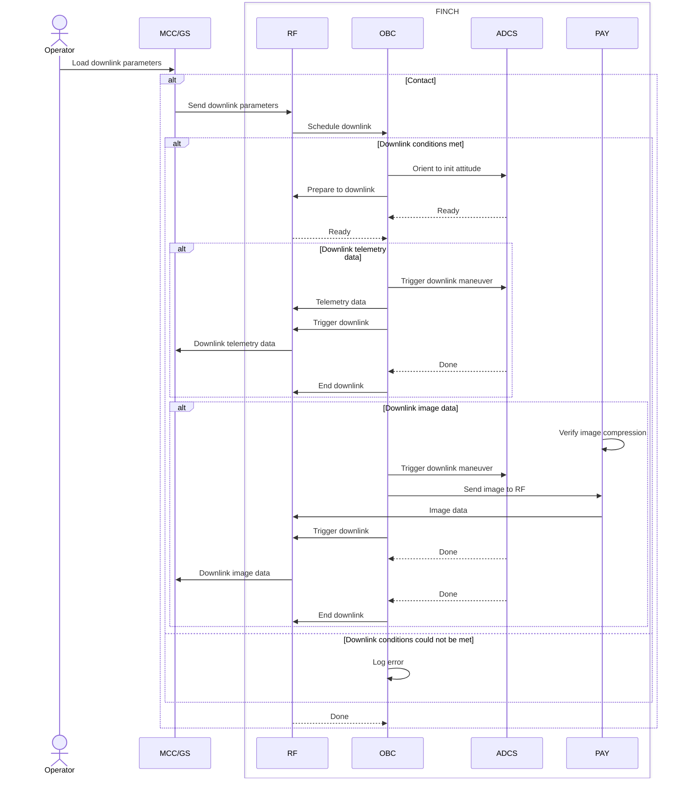

# Downlinking Command Sequence

```mermaid

sequenceDiagram

    Actor Operator
    participant MCC/GS
    box FINCH
        participant RF
        participant OBC
        participant ADCS
        participant PAY
    end

    Operator->>MCC/GS: Load downlink parameters
    
    alt Contact
        MCC/GS->>RF: Send downlink parameters
        RF->>OBC: Schedule downlink
        
        alt Downlink conditions met
            OBC->>ADCS: Orient to init attitude
            OBC->>RF: Prepare to downlink
            ADCS-->>OBC: Ready
            RF-->>OBC: Ready

            alt Downlink telemetry data
                OBC->>ADCS: Trigger downlink maneuver
                OBC->>RF: Telemetry data
                OBC->>RF: Trigger downlink
                RF->>MCC/GS: Downlink telemetry data
                ADCS-->>OBC: Done
                OBC->>RF: End downlink
            end

            alt Downlink image data
                PAY->>PAY: Verify image compression
                OBC->>ADCS: Trigger downlink maneuver
                OBC->>PAY: Send image to RF
                PAY->>RF: Image data
                OBC->>RF: Trigger downlink
                ADCS-->>OBC: Done
                RF->>MCC/GS: Downlink image data
                ADCS-->>OBC: Done
                OBC->>RF: End downlink
            end

        else Downlink conditions could not be met
            OBC->>OBC: Log error
        end
    
    
    RF-->>OBC: Done  
    
    end

```