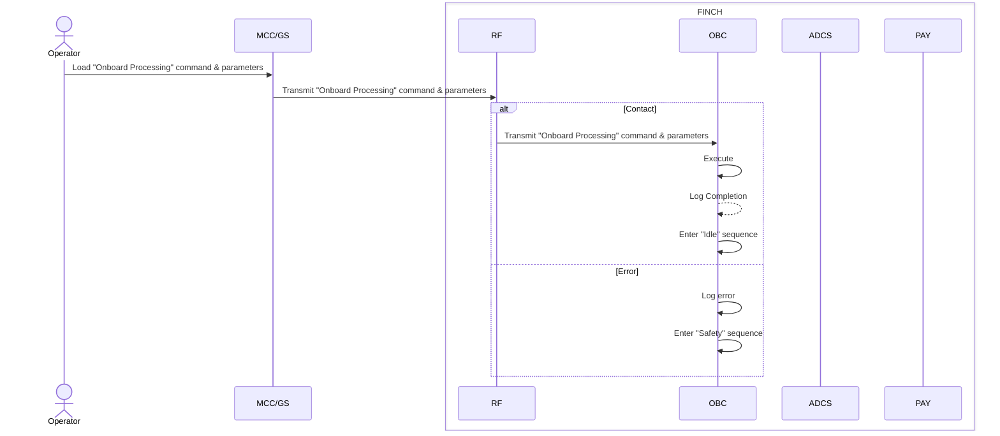

# Onboard Processing Command Sequence

```mermaid

sequenceDiagram
    Actor Operator
    participant MCC/GS
    box FINCH
        participant RF
        participant OBC
        participant ADCS
        participant PAY
    end

    Operator->>MCC/GS: Load "Onboard Processing" command & parameters
    MCC/GS->>RF: Transmit "Onboard Processing" command & parameters

    alt Contact
        RF->>OBC: Transmit "Onboard Processing" command & parameters
        OBC->>OBC: Execute
        OBC-->>OBC: Log Completion
        OBC->>OBC: Enter "Idle" sequence
    
    else Error
        OBC->>OBC: Log error
        OBC->>OBC: Enter "Safety" sequence
    end
    

```
