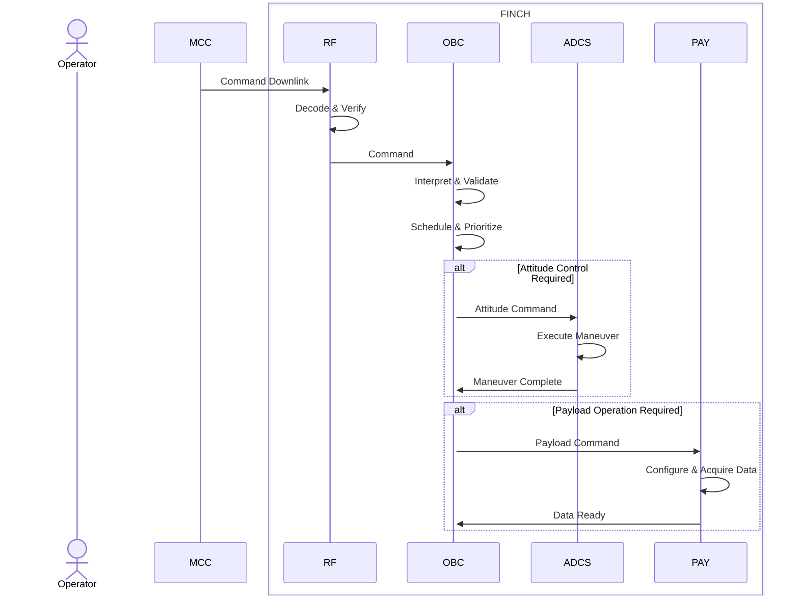

```mermaid

sequenceDiagram
    Actor Operator
    participant MCC
    box FINCH
        participant RF
        participant OBC
        participant ADCS
        participant PAY
    end
    MCC->>RF: Command Downlink
    RF->>RF: Decode & Verify
    RF->>OBC: Command

    activate OBC
    OBC->>OBC: Interpret & Validate
    OBC->>OBC: Schedule & Prioritize

    alt Attitude Control Required
        OBC->>ADCS: Attitude Command
        ADCS->>ADCS: Execute Maneuver
        ADCS->>OBC: Maneuver Complete
    end

    alt Payload Operation Required
        OBC->>PAY: Payload Command
        PAY->>PAY: Configure & Acquire Data
        PAY->>OBC: Data Ready
    end
    

```
