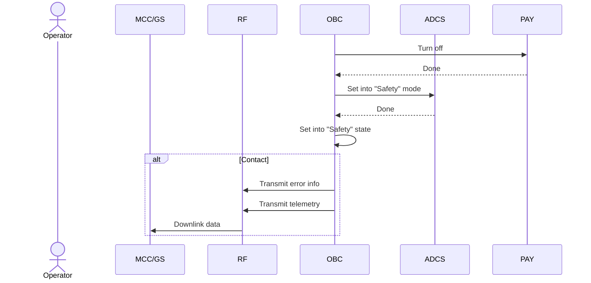

# Safety Command Sequence 

```mermaid
sequenceDiagram
    Actor Operator
    participant MCC/GS
    participant RF
    participant OBC
    participant ADCS
    participant PAY

    OBC->>PAY: Turn off
    PAY-->>OBC: Done
    OBC->>ADCS: Set into "Safety" mode
    ADCS-->>OBC: Done

    OBC->>OBC: Set into "Safety" state

    alt Contact
        OBC->>RF: Transmit error info
        OBC->>RF: Transmit telemetry
        RF->>MCC/GS: Downlink data
    end
    
```
