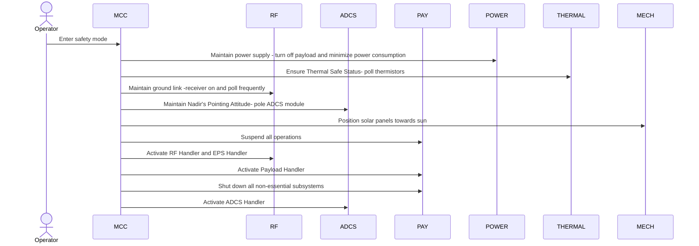

# Safety Command Sequence 

```mermaid
sequenceDiagram
    Actor Operator
    participant MCC
    participant RF
    participant ADCS
    participant PAY
    participant POWER
    participant THERMAL
    participant MECH
    Operator ->> MCC: Enter safety mode 
    MCC ->> POWER: Maintain power supply - turn off payload and minimize power consumption 
    MCC ->> THERMAL: Ensure Thermal Safe Status- poll thermistors
    MCC ->> RF: Maintain ground link -receiver on and poll frequently
    MCC ->> ADCS: Maintain Nadir's Pointing Attitude- pole ADCS module
    MCC ->> MECH: Position solar panels towards sun 
    MCC ->> PAY: Suspend all operations 
    MCC ->> RF: Activate RF Handler and EPS Handler 
    MCC ->> PAY: Activate Payload Handler
    MCC ->> PAY: Shut down all non-essential subsystems
    MCC ->> ADCS: Activate ADCS Handler

    
```
