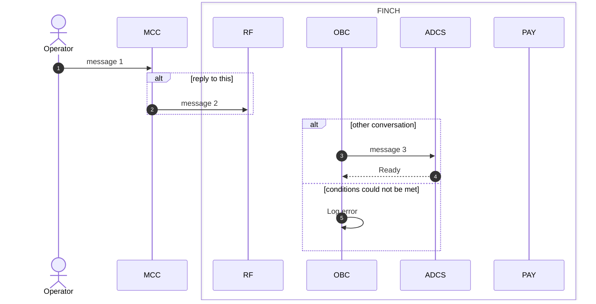

# Safety Command Sequence 

```mermaid
sequenceDiagram
autonumber %% numbers the messages 
    Actor Operator
    participant MCC
    box FINCH
        participant RF
        participant OBC
        participant ADCS
        participant PAY
    end
    Operator->>MCC: message 1
    alt reply to this
        MCC->>RF: message 2
    end
    alt other conversation
            OBC->>ADCS: message 3
            ADCS-->>OBC: Ready
    else conditions could not be met
            OBC->>OBC: Log error
    end
```
