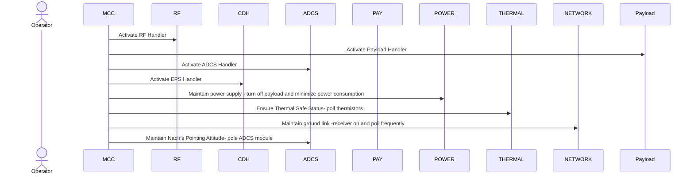

# Safety Command Sequence 

```mermaid
sequenceDiagram
    Actor Operator
    participant MCC
    participant RF
    participant CDH
    participant ADCS
    participant PAY
    participant POWER
    participant THERMAL
    participant NETWORK
    MCC ->> RF: Activate RF Handler
    MCC ->> Payload: Activate Payload Handler
    MCC ->> ADCS: Activate ADCS Handler
    MCC ->> CDH: Activate EPS Handler 
    MCC ->> POWER: Maintain power supply - turn off payload and minimize power consumption 
    MCC ->> THERMAL: Ensure Thermal Safe Status- poll thermistors
    MCC ->> NETWORK: Maintain ground link -receiver on and poll frequently
    MCC ->> ADCS: Maintain Nadir's Pointing Attitude- pole ADCS module
    
```
