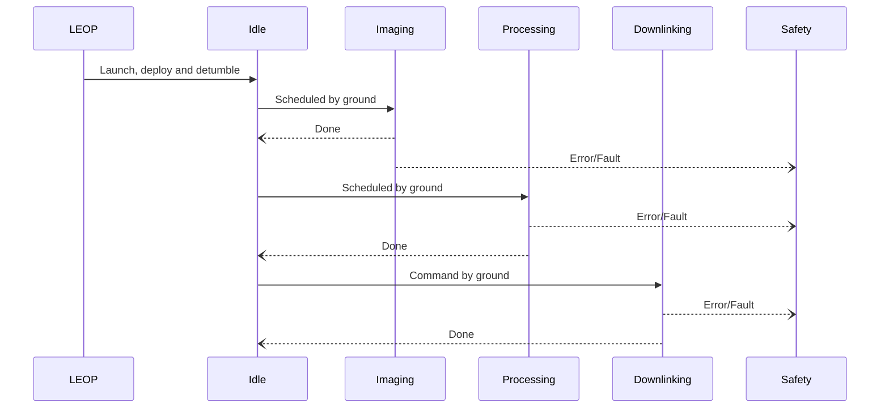

# FINCH Mission Modes of Operations Flow Diagram

```mermaid
sequenceDiagram
    participant LEOP
    participant Idle
    participant Imaging
    participant Processing
    participant Downlinking
    participant Safety


    LEOP->>Idle: Launch, deploy and detumble  

    Idle->>Imaging: Scheduled by ground
    Imaging--)Idle: Done
    Imaging--)Safety: Error/Fault


    Idle->>Processing: Scheduled by ground
    Processing--)Safety: Error/Fault
    Processing--)Idle: Done
    
    
    Idle->>Downlinking: Command by ground
    Downlinking--)Safety: Error/Fault
    Downlinking--)Idle: Done

```
