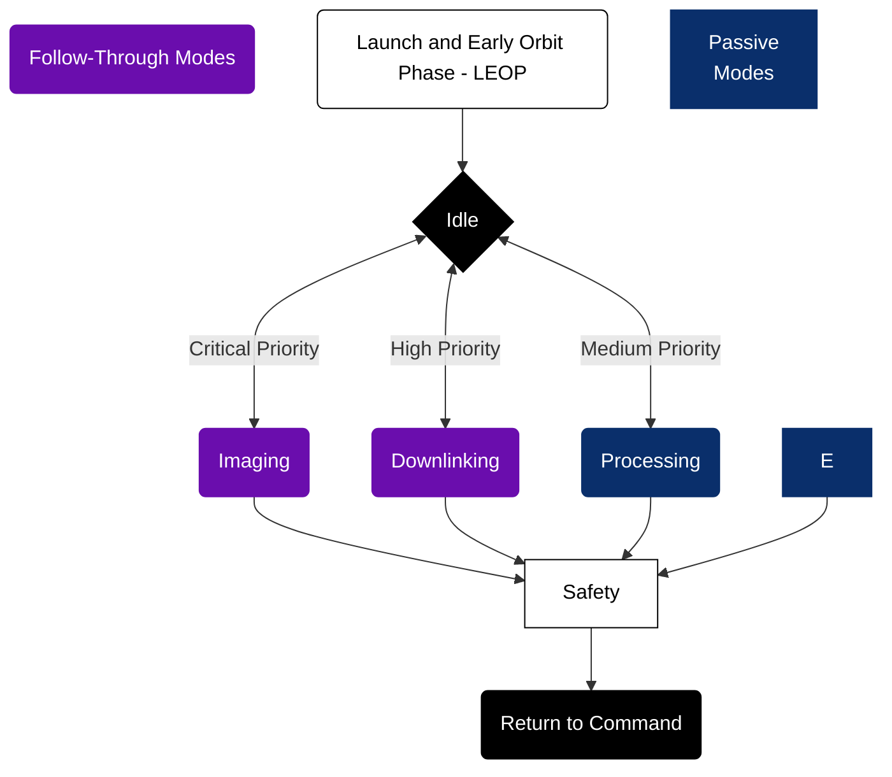

# Modes of Operation

```mermaid

flowchart
 K(Follow-Through Modes)
 Z(Launch and Early Orbit Phase - LEOP) -->
 A{Idle} <---> |Critical Priority|B(Imaging)
 A <---> |High Priority|C(Downlinking)
 A <---> |Medium Priority|D(Processing)
 B --> Y
 C -->Y[Safety]
 D -->Y
 E -->Y
 R[Passive
 Modes]
 Y --> S(Return to Command)
style Z fill:#FFFFFF,stroke:#000000,color:#000000
style A fill:#000000,stroke:#000000,color:#FFFFFF
style B fill:#6A0DAD,stroke:#6A0DAD,color:#FFFFFF
style C fill:#6A0DAD,stroke:#6A0DAD,color:#FFFFFF
style D fill:#0A2F6B,stroke:#0A2F6B,color:#FFFFFF
style E fill:#0A2F6B,stroke:#0A2F6B,color:#FFFFFF
style Y fill:#FFFFFF,stroke:#000000,color:#000000
style S fill:#000000,stroke:#000000,color:#FFFFFF
style K fill:#6A0DAD,stroke:#6A0DAD,color:#FFFFFF
style R fill:#0A2F6B,stroke:#0A2F6B,color:#FFFFFF

```
