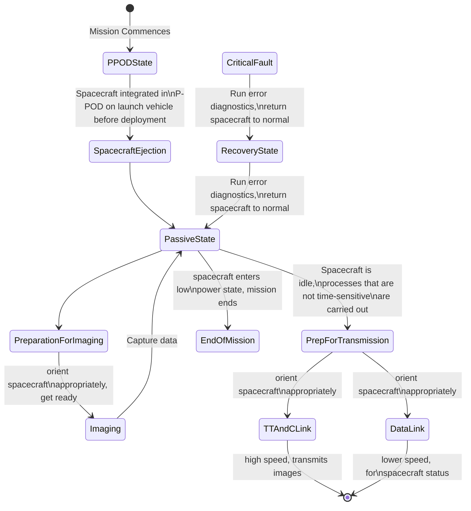

# Modes of Operation

```mermaid
stateDiagram-v2
    [*] --> PPODState: Mission Commences
    PPODState --> SpacecraftEjection: Spacecraft integrated in\nP-POD on launch vehicle before deployment
    SpacecraftEjection --> PassiveState
    PassiveState --> PreparationForImaging
    PreparationForImaging --> Imaging: orient spacecraft\nappropriately, get ready
    Imaging --> PassiveState: Capture data
    PassiveState --> PrepForTransmission: Spacecraft is idle,\nprocesses that are not time-sensitive\nare carried out
    PrepForTransmission --> DataLink: orient spacecraft\nappropriately
    PrepForTransmission --> TTAndCLink: orient spacecraft\nappropriately

    TTAndCLink --> [*]: high speed, transmits images
    DataLink --> [*]: lower speed, for\nspacecraft status

    PassiveState --> EndOfMission: spacecraft enters low\npower state, mission ends

    CriticalFault --> RecoveryState: Run error diagnostics,\nreturn spacecraft to normal
    RecoveryState --> PassiveState: Run error diagnostics,\nreturn spacecraft to normal


```
