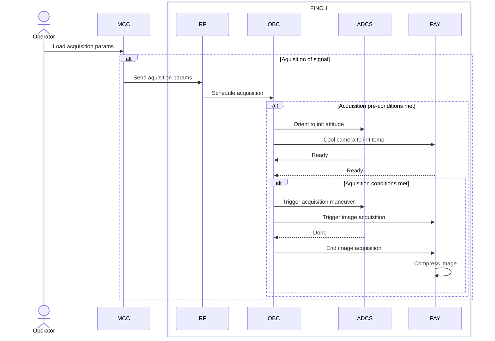

# Image Acquisition Command Sequence

```mermaid
sequenceDiagram
    Actor Operator
    participant MCC
    box FINCH
        participant RF
        participant OBC
        participant ADCS
        participant PAY
    end

    Operator->>MCC: Load acquisition params
    alt Aquisition of signal
        MCC->>RF: Send aquisition params

        RF->>OBC: Schedule acquisition

        alt Acquisition pre-conditions met
            OBC->>ADCS: Orient to init attitude
            OBC->>PAY: Cool camera to init temp
            ADCS-->>OBC: Ready
            PAY-->>OBC: Ready

            alt Aquisition conditions met
                OBC->>ADCS: Trigger acquisition maneuver
                OBC->>PAY: Trigger image acquisition
                ADCS-->>OBC: Done
                OBC->>PAY: End image acquisition
                PAY->>PAY: Compress image


            end
        end


    end

    

```
