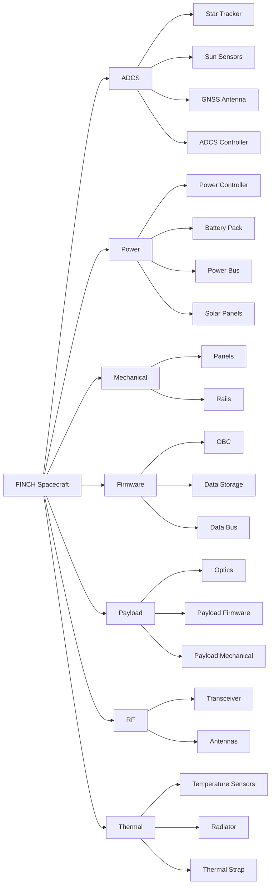

# FINCH System Hierachy Diagram
See [System Architecture](https://www.notion.so/utat-ss/aa7abed08ca749f685d8266b6ede20ce?v=2676ae2481e843a49b551e2e7c0308ed&pvs=4) database for source truth. This diagram should someday be generated from the database using TreeViz.
